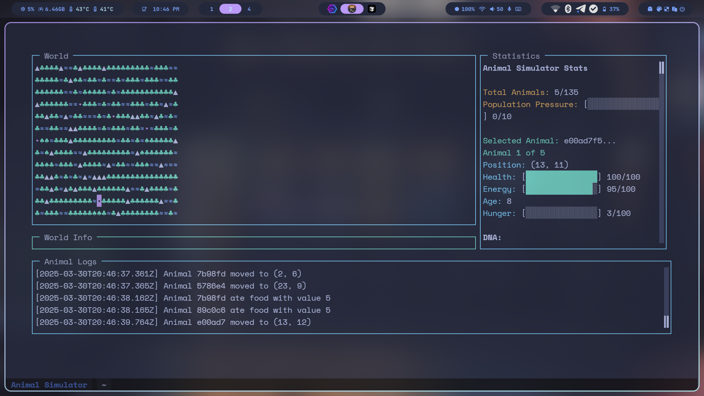

# Fluffles Simulator

## Overview

Fluffles Simulator is an evolutionary simulation that models a population of small creatures called "Fluffles" in a dynamic ecosystem. The simulation demonstrates natural selection, genetic inheritance, and emergent behaviors as Fluffles compete for resources, reproduce, and adapt to their environment.

## Features

- **Genetic Evolution**: Fluffles inherit traits from their parents with slight mutations, allowing populations to evolve over time.
- **Complex Behaviors**: Fluffles make decisions based on their needs, genetic traits, and environmental conditions.
- **Life Cycle**: Fluffles are born, mature, reproduce, and eventually die of old age or other causes.
- **Predation**: Hungry or aggressive Fluffles may attack others to survive.
- **Environmental Challenges**: Natural disasters like earthquakes, droughts, disease, and cold snaps create evolutionary pressure.
- **Terrain Variety**: The world contains grass (food), water, and rocks, each affecting movement and survival.
- **Population Dynamics**: Overcrowding creates pressure that affects reproduction and resource availability.

## Genetic Traits

Fluffles have various genetic traits that influence their behavior and survival:

- **Size**: Affects energy consumption and appearance
- **Speed**: Determines movement efficiency and hunting/escape success
- **Metabolism**: Controls energy usage and hunger rate
- **Intelligence**: Affects decision-making quality
- **Aggression**: Influences tendency to attack other Fluffles
- **Friendship**: Counteracts aggression and promotes social behavior
- **Social Behavior**: Determines desire to be near other Fluffles
- **Reproductive Urge**: Affects frequency of mating attempts
- **Lifespan**: Determines maximum age
- **Maturity Age**: Sets when a Fluffles can reproduce
- **Fur Color**: Visual trait with no survival impact

## Controls

- **Left/Right Arrows**: Select previous/next animal
- **H**: Toggle help screen
- **+/-**: Increase/decrease simulation speed
- **Q** or **Esc**: Quit the simulation

## Visual Indicators

- **F, f**: Adult Fluffles (different sizes)
- **•**: Baby Fluffles (not mature yet)
- **♥**: Fluffles that are mating
- **♣, ♠, ·**: Grass (different densities)
- **≈**: Water
- **▲**: Rocks/Mountains

## Life Cycle

1. Fluffles are born as babies (•)
2. They mature around age 25 (varies by genetics)
3. They can mate only when mature (takes 4 turns)
4. Their lifespan is around 100 (varies by genetics)
5. Population pressure affects reproduction success

## Technical Details

The simulation is built with TypeScript and uses the Blessed library for terminal-based UI. It implements:

- A genetic system with inheritance and mutation
- A tile-based world with different terrain types
- A decision-making system based on needs and traits
- Environmental challenges and disasters
- Detailed logging and statistics

**NOTE:** This has been coded using Claude 3.7 Sonnet as a guide and is a fun project to play around with. Don't take it too seriously.

## Running the Simulation

To run the simulation:

1. Make sure you have Node.js and Bun installed
2. Clone the repository
3. Run `bun install` to install dependencies
4. Run `bun start` to start the simulation

Logs are saved to the `logs` directory for later analysis.

## Development

The codebase is organized into several key components:

- **Animal**: Base class for all creatures
- **Fluffles**: Implementation of the specific animal type
- **DNA**: Handles genetic traits, inheritance and mutation
- **World**: Manages the terrain, resources, and population
- **Simulation**: Controls the overall simulation flow
- **Renderer**: Handles the terminal-based UI
- **Logger**: Records events for analysis

## License

This project is licensed under the MIT License. See the LICENSE file for details.
